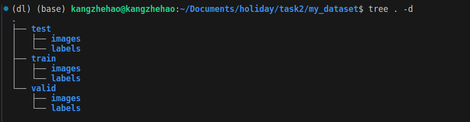
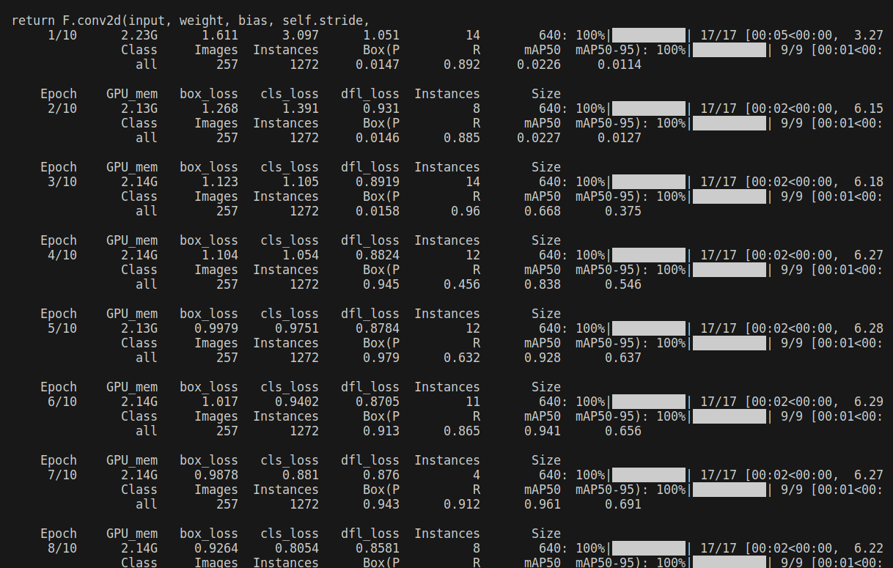

# 深度学习任务报告

### 任务2
#### 1. 环境说明
    - 使用本地conda平台，配置pytorch进行训练，安装准备ultralytics包
#### 2. 数据集
    - 下载提供的数据集，使用python脚本进行训练集，验证集，测试集的划分，满足yolov8数据集格式要求

#### 3. 训练
```python
    from ultralytics import YOLO

    # Load a model
    # model = YOLO('yolov8n.pt')  # load a pretrained model (recommended for training)

    # Train the model
    model.train(data='/home/kangzhehao/Documents/holiday/task2/data.yaml', epochs=10, imgsz=640)
```
- 使用yolov8官方预训练的模型训练10个epoch，训练过程如下：

#### 4.  测试 
```python
    # 导入必要的库
    import cv2
    from ultralytics import YOLO

    # 加载 YOLO 模型
    model = YOLO('/home/kangzhehao/Documents/holiday/task2/runs/detect/train/weights/best.pt')

    # 设置输入视频的路径
    video_path = "./深度学习任务二测试视频.mp4"
    cap = cv2.VideoCapture(video_path)

    # 获取视频的帧宽度、帧高度和帧速率
    frame_width = int(cap.get(3))
    frame_height = int(cap.get(4))
    fps = cap.get(cv2.CAP_PROP_FPS)

    # 定义编解码器和输出视频文件
    fourcc = cv2.VideoWriter_fourcc(*'mp4v')
    out = cv2.VideoWriter('./output.mp4', fourcc, fps, (frame_width, frame_height))

    # 循环遍历视频帧
    while cap.isOpened():
        success, frame = cap.read()
        if success:
            # 使用 YOLO 模型进行目标检测或跟踪
            results = model.track(frame, persist=True)
            # 绘制带注释的帧
            annotated_frame = results[0].plot()
            out.write(annotated_frame)
        else:
            break

    # 释放视频捕获和视频写入对象
    cap.release()
    out.release()
```
- 测试发现对车的追踪基本正确，但是有些地方效果不是很好，会出现追踪丢失的情况
- 结果为output.mp4

####  5. 尝试使用更大的yolov8s模型进行训练，同时增大epochs，调整训练参数
```python
    from ultralytics import YOLO

    # Load a model
    model = YOLO('yolov8s.pt')  # load a pretrained model (recommended for training)

    # Train the model
    model.train(data='/home/kangzhehao/Documents/holiday/task2/data.yaml', epochs=50, imgsz=640)

```
- 结果为output1.mp4